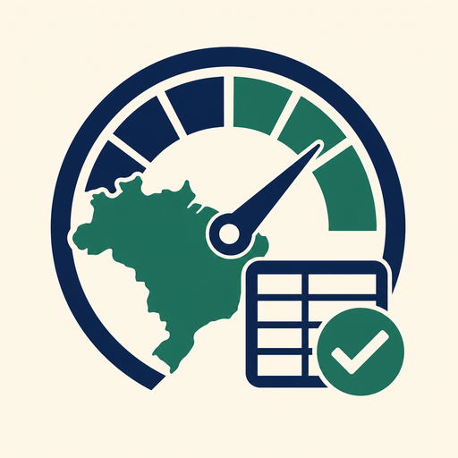
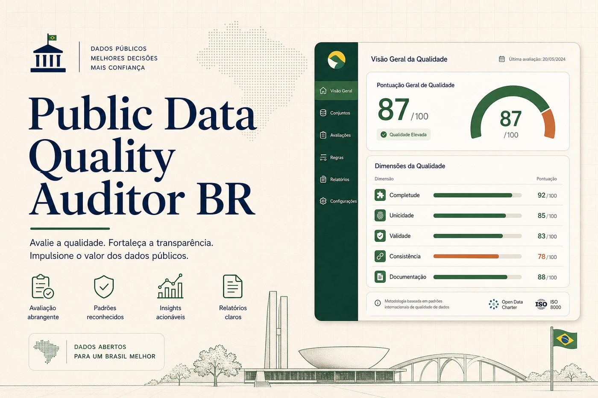
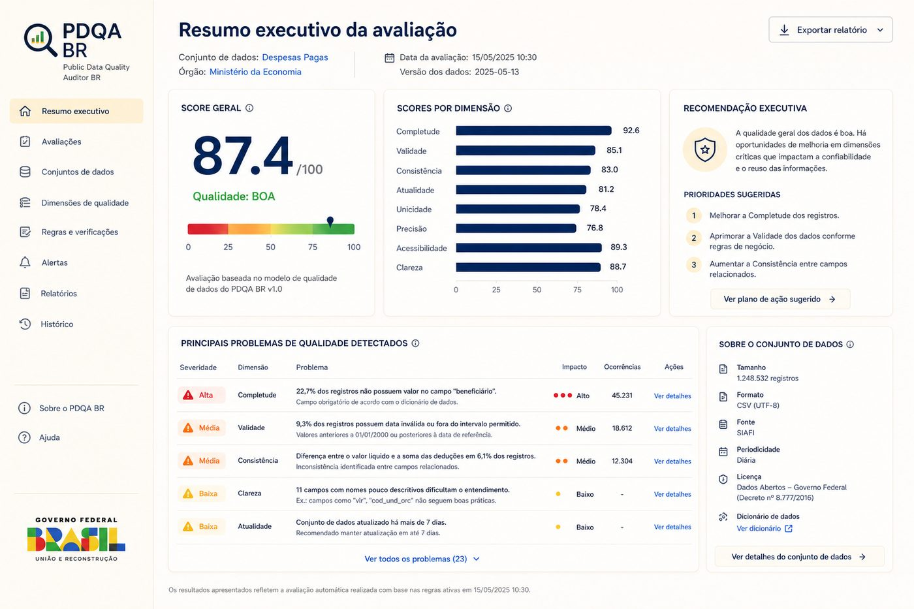
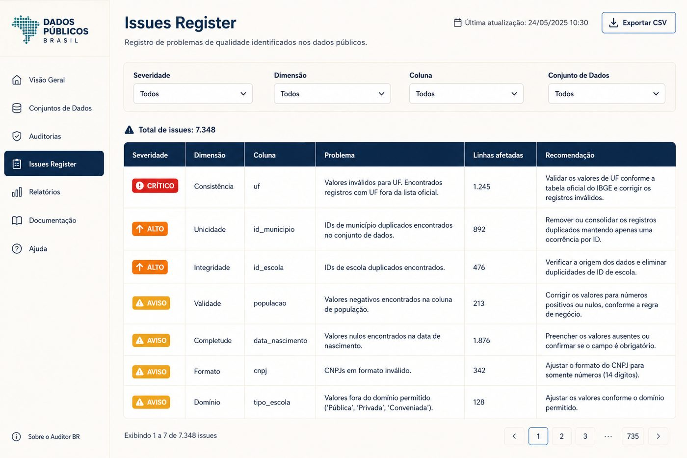
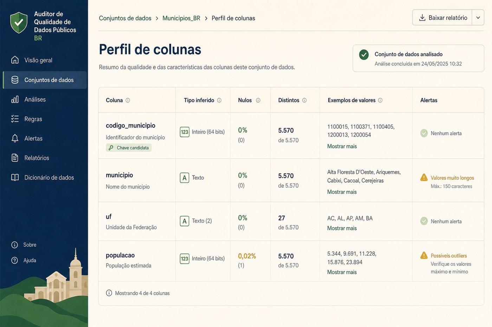
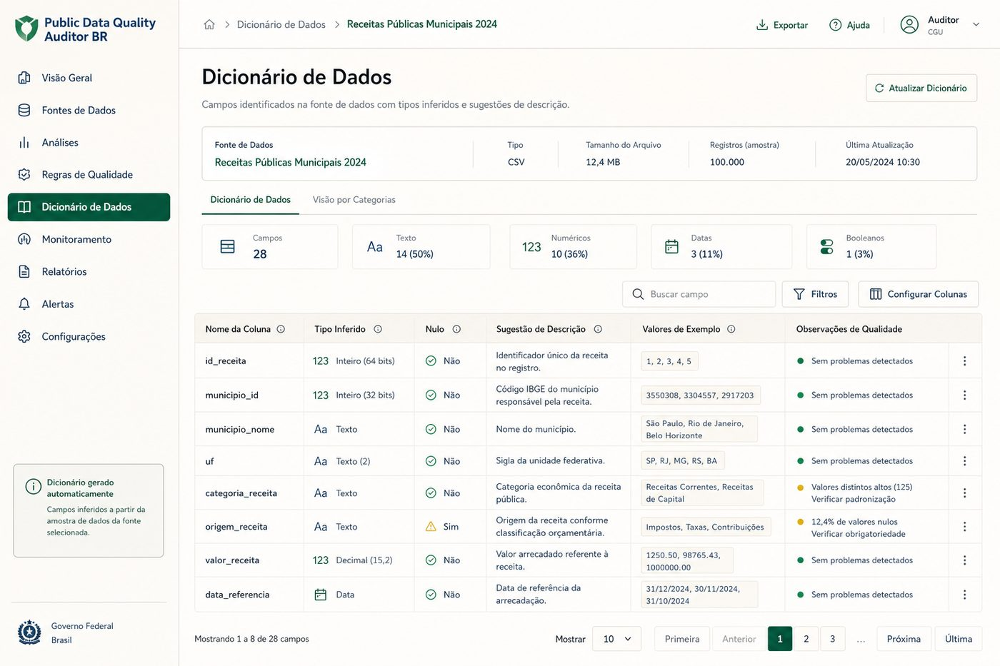
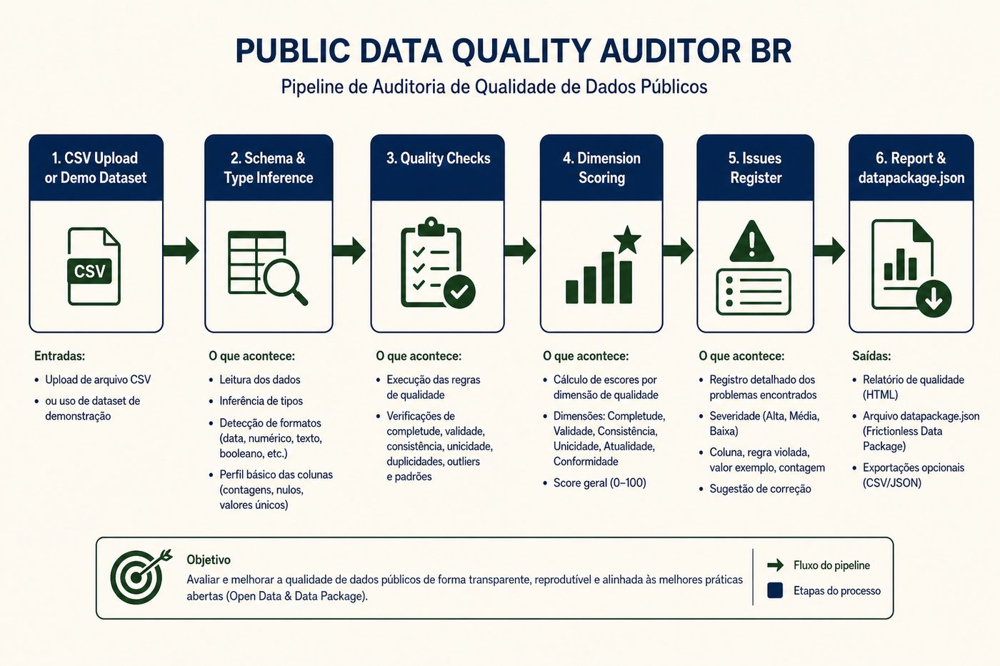

<div align="center">
  

  <h1>Public Data Quality Auditor BR</h1>

  <p><strong>Profiling, validações, score explicável e relatório executivo para CSVs de dados públicos brasileiros.</strong></p>
  <p><strong>Explainable profiling, rule-based checks and executive reporting for Brazilian public CSV datasets.</strong></p>

  <p>
    <a href="#1-visão-geral--overview">PT-BR / English Overview</a> •
    <a href="#-product-preview">Preview</a> •
    <a href="#-screenshots">Screenshots</a> •
    <a href="#️-stack--tecnologias">Stack</a> •
    <a href="#-arquitetura--architecture">Architecture</a> •
    <a href="#-quick-start--início-rápido">Quick Start</a> •
    <a href="#-autor--author">Author</a>
  </p>

  <p>
    
    
    
    
    
    
  </p>
</div>

<p align="center">
  
</p>

---

## 1. Visão Geral / Overview

O **Public Data Quality Auditor BR** é um produto de dados criado para auditar a qualidade de bases públicas brasileiras em CSV antes que elas sustentem análises, reportagens ou decisões.

Ele automatiza um fluxo de **ingestão, detecção de schema, profiling, checks de qualidade, score por dimensão, registro de problemas, dicionário de dados, relatório executivo e `datapackage.json`**. Em vez de tratar o CSV como uma planilha isolada, a ferramenta o transforma em um diagnóstico rastreável, com evidências, limitações e recomendações.

O projeto foi desenvolvido por **Felipe Alirio Baruja** como peça de portfólio em data quality / analytics engineering com utilidade cívica.

> **Diagnostic Notice**  
> O score é um **diagnóstico explicável**, não uma certificação absoluta. A auditoria **não valida a verdade factual** dos dados, não avalia conteúdo político e não substitui revisão humana de licença, atualização e dicionário.

---

## ✨ Product Preview

<p align="center">
  
</p>

A interface apresenta uma experiência analítica clara: score geral, scores por dimensão, recomendação executiva, issues priorizados, perfil por coluna e dicionário gerado automaticamente.

---

## 2. Por que este projeto importa? / Why this project matters

* **Dados públicos são úteis — e frequentemente sujos:** nulos, duplicidades, datas inválidas, UFs quebradas e metadados fracos passam despercebidos até contaminar a análise.
* **Qualidade precisa ser explicável:** não basta um número. É preciso mostrar dimensão afetada, severidade, amostra de linhas e recomendação.
* **Produto, não notebook:** API FastAPI + UI Next.js entregam uma ferramenta séria de auditoria, com testes e documentação metodológica.
* **Utilidade cívica:** jornalistas, pesquisadores, analistas e cidadãos técnicos ganham uma camada de confiança antes de publicar insights.

---

## 🧠 O diferencial / What makes it different

### Português
Não é apenas um profiler genérico. Combina checks testáveis, score ponderado por dimensões, issues register, dicionário sugerido e artefatos exportáveis (`relatório` + `datapackage.json`), com metodologia e limitações explícitas.

Ele mostra:
- quão confiável a base parece estruturalmente;
- quais problemas merecem ação primeiro;
- quais colunas concentram risco;
- como documentar o dataset após a auditoria;
- onde a interpretação precisa ser limitada.

### English
This is not just a generic profiler. It combines testable checks, a weighted dimensional score, an issues register, a suggested data dictionary and exportable artifacts (`report` + `datapackage.json`), with explicit methodology and limitations.

It shows:
- how structurally reliable the dataset appears;
- which problems deserve action first;
- which columns concentrate risk;
- how to document the dataset after the audit;
- where interpretation must be limited.

---

## 🎯 Problema que resolve / The problem it solves

Bases abertas brasileiras costumam chegar com:
- colunas sem descrição útil;
- formatos inconsistentes;
- nulos e linhas vazias;
- duplicidades e IDs repetidos;
- datas inválidas e números como texto;
- categorias com variação de caixa/acento;
- valores fora de faixa (ex.: população negativa);
- ausência de dicionário e licença clara.

O **Public Data Quality Auditor BR** cria uma camada auditável entre o CSV bruto e a análise final.

---

## 🧩 Proposta / Analytical Pipeline

```txt
CSV Upload / Demo Dataset (municípios, escolas, contratos)
  ↓
Parsing (encoding + separador)
  ↓
Schema & type inference
  ↓
Profiling (nulos, distintos, amostras, min/max)
  ↓
Quality checks (12+ regras testáveis)
  ↓
Dimension scores + overall score (0–100)
  ↓
Issues Register + recommendations
  ↓
Data dictionary + Markdown/HTML report + datapackage.json
```

---

## 📸 Screenshots

<table>
  <tr>
    <td width="50%">
      
      <br />
      <sub><strong>Audit Summary</strong> — score geral, dimensões e recomendação executiva.</sub>
    </td>
    <td width="50%">
      
      <br />
      <sub><strong>Issues Register</strong> — severidade, dimensão, amostra de linhas e recomendação.</sub>
    </td>
  </tr>
  <tr>
    <td width="50%">
      
      <br />
      <sub><strong>Column Profile</strong> — tipo inferido, nulos, distintos, exemplos e warnings.</sub>
    </td>
    <td width="50%">
      
      <br />
      <sub><strong>Data Dictionary</strong> — descrições sugeridas, exemplos e notas de qualidade.</sub>
    </td>
  </tr>
</table>

---

## 📄 Relatório exportável / Exportable Report

O relatório Markdown/HTML consolida:
- nome do dataset e data da auditoria;
- linhas/colunas e score geral;
- scores por dimensão;
- top issues e colunas mais problemáticas;
- recomendações;
- dicionário resumido;
- limitações e próximos passos.

Também é possível baixar um `datapackage.json` simples (Frictionless-inspired) com fields inferidos.

---

## 📌 Estudo de Caso / Case Study

### 📌 Estudo de Caso: Municípios BR (demo)
O dataset demo de municípios é sintético-realista e inclui problemas intencionais: UF inválida, população negativa, datas inválidas, código duplicado, variação de acento e linha vazia. Em execução local validada, a auditoria processou **32 linhas / 6 colunas**, gerou issues acionáveis e um score geral de **87.4/100** (completude 92, unicidade 85, validade 76, consistência 92, documentabilidade 100).

### 📌 Case Study: Brazilian Municipalities (demo)
The municipalities demo is synthetic-realistic and intentionally dirty: invalid UF, negative population, invalid dates, duplicated codes, accent variants and an empty row. In a validated local run, the audit processed **32 rows / 6 columns**, produced actionable issues and an overall score of **87.4/100**.

Demos adicionais: **escolas** e **contratos públicos**, com nulos, categorias inconsistentes, CNPJ inválido, valores negativos e datas invertidas.

---

## 🧭 Visual Story / Jornada Analítica

```txt
1. Abrir a home e entender a tese: audite antes de analisar
2. Escolher um dataset demo ou enviar um CSV
3. Ler o score geral e os scores por dimensão
4. Inspecionar a recomendação executiva
5. Filtrar o Issues Register por severidade/dimensão/coluna
6. Revisar o perfil por coluna
7. Conferir o dicionário sugerido
8. Exportar relatório Markdown/HTML e datapackage.json
9. Corrigir a origem e reauditar
```

---

## ⚙️ Funcionalidades Principais / Core Features

### Demo + Upload
Três datasets demo locais (sem dependência de rede) e upload de CSV (limite MVP: 5 MB / 50 mil linhas), com fallback de encoding e separador.

### Quality Score explicável
Score 0–100 com pesos:
- Completude **25**
- Unicidade **20**
- Validade **25**
- Consistência **20**
- Documentabilidade **10**

Penalidades por severidade (`info`, `warning`, `high`, `critical`) e volume afetado.

### Issues Register
Problemas estruturados com tipo, dimensão, severidade, contagem, amostra de linhas e recomendação.

### Column Profiling
Tipo inferido, nulos, distintos, min/max, exemplos e warnings por coluna.

### Data Dictionary + Data Package
Descrições sugeridas, exemplos, notas de qualidade e descriptor `datapackage.json` simples.

---

## 🛠️ Stack / Tecnologias

### Frontend
- **Framework:** Next.js 15 (App Router) & React 19
- **Linguagem:** TypeScript
- **Estilização:** Tailwind CSS
- **Gráficos:** Recharts
- **Ícones:** Lucide Icons

### Backend
- **API:** FastAPI & Uvicorn (Python 3.12)
- **Validação:** Pydantic v2
- **Dados:** Pandas
- **Testes:** Pytest + httpx / TestClient

### Dados & Ops
- CSVs demo em `data/demo/`
- Outputs de auditoria em `data/audit_outputs/`
- `docker-compose.yml` opcional

---

## 🧱 Arquitetura / Architecture

```text
public-data-quality-auditor-br/
├── apps/
│   ├── web/                         # Frontend Next.js
│   │   ├── src/app/                 # Home, /audit, /audit/[id], /methodology
│   │   ├── src/components/          # Score, charts, tables, panels
│   │   ├── src/lib/                 # API client
│   │   └── src/types/               # Tipos TypeScript
│   │
│   └── api/                         # Backend FastAPI
│       ├── app/
│       │   ├── api/                 # Rotas REST
│       │   ├── quality/             # Profiling, checks, scoring, engine
│       │   ├── reports/             # Markdown + datapackage
│       │   ├── schemas/             # Modelos Pydantic
│       │   └── services/            # Upload, demo, store
│       └── tests/                   # Pytest (checks + API)
│
├── data/
│   ├── demo/                        # municipios / escolas / contratos
│   └── audit_outputs/               # Artefatos gerados (gitignored)
│
├── docs/                            # Metodologia, dimensões, fontes, limitações
├── assets/                          # Ícone, hero, screenshots, social preview
├── HANDOFF_PORTFOLIO.md
└── README.md
```

---

## 🧱 Visual Architecture

<p align="center">
  
</p>

Fluxo rastreável: CSV/demo → parsing → inferência → checks → scoring → issues → relatório / datapackage.

---

## 🔁 Data Flow Pipeline

```txt
Raw CSV / Demo
  ↓
Encoding & delimiter detection
  ↓
Type inference & profiling
  ↓
Rule-based quality checks
  ↓
Dimension scoring (weighted)
  ↓
Issues + dictionary generation
  ↓
Dashboard / Markdown-HTML report / datapackage.json
```

---

## 🚀 Quick Start / Início Rápido

### Pré-requisitos
- **Node.js** 20+ (testado com 24)
- **Python** 3.12
- **Git**

### 1. Backend FastAPI (`apps/api`)

```bash
cd apps/api
python -m venv .venv
.venv\Scripts\activate            # Windows
# source .venv/bin/activate       # Linux/macOS
pip install -r requirements.txt
uvicorn app.main:app --reload --port 8000
```

Se a porta `8000` estiver ocupada:

```bash
uvicorn app.main:app --reload --port 8001
```

API: [http://127.0.0.1:8000](http://127.0.0.1:8000) · OpenAPI: `/docs`

### 2. Frontend Next.js (`apps/web`)

```bash
cd apps/web
copy .env.local.example .env.local   # Windows
# cp .env.local.example .env.local   # Linux/macOS
npm install
npm run dev
```

Ajuste `NEXT_PUBLIC_API_URL` se a API não estiver em `http://localhost:8000`.

UI: [http://localhost:3000](http://localhost:3000)

### Docker (opcional)

```bash
docker compose up --build
```

---

## 🧪 Scripts e Testes / Scripts and Testing

```bash
cd apps/api
.venv\Scripts\python -m pytest tests -q
```

Cobertura do MVP inclui: nulos, coluna vazia, duplicatas, ID duplicado, data/número inválidos, categoria inconsistente, scores, dicionário, relatório, datapackage e fluxo de API (demo + upload).

---

## 📊 Metodologia de Qualidade / Quality Methodology

| Dimensão | Peso | Foco |
|----------|------|------|
| Completude | 25 | nulos, colunas/linhas vazias |
| Unicidade | 20 | duplicatas e IDs repetidos |
| Validade | 25 | datas, números, UF, CNPJ, faixas |
| Consistência | 20 | caixa/acento, tipos mistos, ordem de datas |
| Documentabilidade | 10 | nomes de colunas e dicionário |

Documentação completa:
- [docs/methodology.md](./docs/methodology.md)
- [docs/quality-dimensions.md](./docs/quality-dimensions.md)
- [docs/data-package-notes.md](./docs/data-package-notes.md)
- [docs/limitations.md](./docs/limitations.md)
- [docs/public-data-sources.md](./docs/public-data-sources.md)

---

## 🛡️ Limitações e responsabilidade

* Score diagnóstico — **não** certifica verdade factual.
* Checks heurísticos podem gerar falsos positivos/negativos.
* CNPJ validado por formato (14 dígitos), não por algoritmo completo.
* Limites do MVP: 5 MB e 50 mil linhas.
* Sem autenticação, crawler ou correção automática irreversível.
* Fontes públicas reais são opcionais; demos locais bastam.

---

## 🧭 Roadmap do Produto

* **MVP atual:** demo + upload, profiling, checks, score, issues, dicionário, relatório, datapackage, testes e docs.
* **Próximo:** histórico SQLite e comparação de versões (score delta).
* **Depois:** validadores BR mais fortes (CNPJ/CPF/IBGE), CLI (`pdqa audit arquivo.csv`), export PDF.
* **Escala:** persistência relacional, filas e suporte a XLSX/Parquet.

---

## 💼 Valor para Portfólio / Portfolio Value

Demonstra competências de:
- **Data Quality Engineering** — regras testáveis, scoring e issues register
- **Analytics Engineering** — profiling e documentação de dataset
- **API Design** — FastAPI + Pydantic + OpenAPI
- **Frontend Analítico** — Next.js + Recharts + tabelas de auditoria
- **Responsabilidade metodológica** — limitações explícitas e handoff de portfólio

Roteiro de apresentação: [HANDOFF_PORTFOLIO.md](./HANDOFF_PORTFOLIO.md)

---

## 📚 Documentação Complementar

- [HANDOFF_PORTFOLIO.md](./HANDOFF_PORTFOLIO.md) — pitch, LinkedIn e guia de entrevista
- [docs/methodology.md](./docs/methodology.md) — pipeline e premissas
- [docs/quality-dimensions.md](./docs/quality-dimensions.md) — pesos e penalidades
- [docs/public-data-sources.md](./docs/public-data-sources.md) — fontes futuras (IBGE, INEP, Transparência…)
- [docs/data-package-notes.md](./docs/data-package-notes.md) — descriptor gerado
- [docs/limitations.md](./docs/limitations.md) — limites honestos do MVP

---

## 🖼️ GitHub Social Preview

Imagem sugerida:

```txt
assets/social-preview.jpg
```

*Dimensão recomendada: 1280×640, &lt;1MB. Upload em: Repository Settings → Social Preview.*

---

## 🔖 GitHub Repository Metadata

### About sugerido

```txt
Explainable data-quality auditing for Brazilian public CSV datasets — profiling, checks, dimensional score, issues register and datapackage export.
```

### Topics sugeridos

```txt
data-quality
analytics-engineering
data-profiling
fastapi
nextjs
typescript
python
pandas
open-data
brazil
civic-tech
csv
datapackage
portfolio-project
dashboard
```

---

## 👤 Autor / Author

Desenvolvido por **Felipe Alirio Baruja**.

- **Portfolio:** [barujafe.vercel.app](https://barujafe.vercel.app/)
- **GitHub:** [@BarujaFe1](https://github.com/BarujaFe1)
- **LinkedIn:** [Felipe Alirio Baruja](https://www.linkedin.com/in/barujafe/)

---

## 📄 Licença / License

MIT License. Copyright (c) 2026 Felipe Alirio Baruja.  
O código está disponível sob a licença MIT caso o arquivo `LICENSE` esteja presente no repositório.
